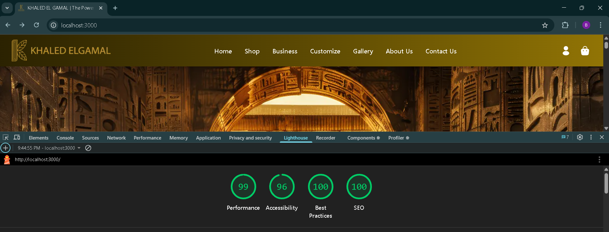

# Khaled El Gammal Frontend

A modern, production-ready e-commerce frontend for Khaled El Gamal, built with **Next.js 15**, **React 19**, **Redux Toolkit**, and **Tailwind CSS**. 

---

## 🚀 Features

- **Next.js 15** with App Router, SSR & CSR support
- **Tailwind CSS** for a clean, fully responsive UI
- **Redux Toolkit** for global state management
- **RTK Query** for efficient data fetching & mutations
- **Add to Cart** with persistent cart (localStorage)
- **Checkout** flow with validation and order summary
- **Authentication** (JWT, cookies) for user/admin
- **Dynamic Product Pages** with SSR/CSR
- **Gallery & Forms** (Business, Contact, Customize)
- **Admin Dashboard** for managing products, orders, users, and custom requests
- **Optimized Images** using Next.js `<Image />`
- **Toast Notifications** for user feedback
- **Loading & Error Handling** everywhere
- **Clean, modular, and scalable codebase**

--- 
## 📊 Lighthouse Score



- **Performance:** 99  
- **Accessibility:** 96  
- **Best Practices:** 100  
- **SEO:** 100 

## 📈 SEO & Meta Tags

### Professional SEO Implementation

This project is built with **SEO best practices** in mind, leveraging Next.js App Router's advanced metadata system for both static and dynamic pages:

- **Global Meta Tags:**  
  The root [`layout.js`](src/app/layout.js) exports a `metadata` object with default `<title>`, `<meta name="description">`, Open Graph, Twitter Card, and favicon for the whole site.

- **Static Pages:**  
  Every static page (like About Us, Contact Us, Business, Customize, Gallery, Shop) exports its own `metadata` object with a unique title, description, keywords, and Open Graph image.  
  Example:
  ```js
  // AboutUs/page.jsx
  export const metadata = {
    title: "About Us | Khaled El Gamal",
    description: "Learn about Khaled El Gamal's journey, values, and commitment to authentic Egyptian craftsmanship.",
    keywords: "About Khaled El Gamal, Egyptian Artisans, Handmade, Khan El Khalili",
    openGraph: { ... }
  };
  ```

- **Dynamic Pages:**  
  Dynamic pages (like product details) use `export async function generateMetadata({ params })` to fetch product data and generate SEO meta tags dynamically, including Open Graph and Twitter images for each product.
  ```js
  // productById/[id]/page.jsx
  export async function generateMetadata({ params }) {
    const res = await fetch(`${process.env.NEXT_PUBLIC_API_URL}/api/products/${params.id}`);
    const product = await res.json();
    return {
      title: `${product.title} | Khaled El Gamal`,
      description: product.description,
      openGraph: { ... }
    };
  }
  ```

- **Open Graph & Social Sharing:**  
  All pages include rich Open Graph and Twitter Card tags for beautiful sharing previews on social media.

- **Accessibility & Best Practices:**  
  - All images have descriptive `alt` attributes.
  - Only one `<h1>` per page.
  - Canonical URLs and robots meta are set for search engines.

- **SSR/CSR:**  
  Product and gallery pages support both SSR and CSR for optimal SEO and performance.

---

## 📁 Project Structure

```
.
├── public/                  # Static assets (images, icons, etc.)
├── src/
│   └── app/
│       ├── components/      # Reusable UI components (Nav1, Footer, Card, etc.)
│       ├── features/Api/    # RTK Query API slices (ProductApi, CheckoutApi, etc.)
│       ├── redux/           # Redux store and slices
│       ├── pages/           # App pages (Gallery, AboutUs, Checkout, etc.)
│       └── utils/           # Utility functions (token handling, etc.)
├── .env                     # Environment variables
├── next.config.mjs          # Next.js config (image domains, etc.)
├── package.json
└── README.md
```

---

## ⚙️ Environment Variables

Create a `.env` file in the root:

```
NEXT_PUBLIC_API_URL=http://localhost:5000
```

---

## 🛠️ Installation & Run

```bash
git clone https://github.com/Abdallah-Wael10/khaled-El-gammal-Front-end-v1.git
cd khaled-El-gammal-Front-end-v1
npm install
npm run dev
```

- The app runs on [http://localhost:3000](http://localhost:3000) by default.

---

## 🧩 Main Features

- **Home Page:** Hero, trending products, gallery slider, contact form.
- **Gallery:** SSR + CSR gallery with modal view.
- **Products:** Dynamic product cards, add to cart, checkout.
- **Forms:** Business, Contact, and Customize forms (with validation & file upload).
- **Authentication:** User & Admin login/register, token stored in cookies.
- **Admin Dashboard:** Protected routes for admin management.
- **Notifications:** User feedback via react-hot-toast.

---

## 🛒 Add to Cart & Checkout

- Cart state is managed globally with Redux Toolkit and persisted in localStorage.
- Add, remove, and update quantities from anywhere.
- Checkout page with full validation, order summary, and payment method selection.
- Orders are submitted via RTK Query mutation.

---

## 🔄 Data Fetching

- **RTK Query** for all API calls (products, gallery, checkout, etc.)
- **SSR/CSR:** Product and gallery pages support both server-side and client-side rendering for best performance and SEO.

---

## 🖼️ Image Handling

- Uses Next.js `<Image />` for optimized images.
- Supports remote images from backend (`localhost:5000`).

---

## 📝 Validation

- All forms have client-side validation for required fields, email, phone, etc.
- Error messages are shown inline and via toast.

---

## 🧑‍💻 Tech Stack

- **Next.js 15**
- **React 19**
- **Redux Toolkit** & **RTK Query**
- **Tailwind CSS**
- **Headless UI** (for modals)
- **react-hot-toast**
- **Swiper** (for sliders)

---

## 🛡️ Authentication

- JWT tokens are stored in cookies using `js-cookie`.
- Protected routes check for token presence and validity.
- Admin dashboard is fully protected.

---

## 🧑‍💼 Admin Dashboard

- Manage products, orders, users, gallery, and customize requests.
- All admin pages are responsive and optimized for mobile/tablet/desktop.

---

## 📱 Responsive Design

- 100% responsive on all screens (mobile, tablet, desktop).
- Clean, modern, and accessible UI.

---

## 📝 License

This project is licensed under the MIT License.

---

## 👨‍💻 Author

- [Abdallah Wael](https://github.com/Abdallah-Wael10)

---

**Feel free to fork, contribute, or open issues!**
